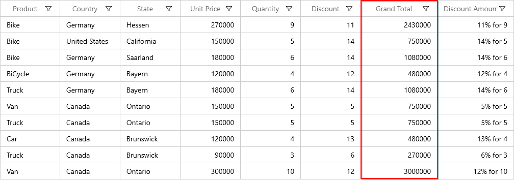
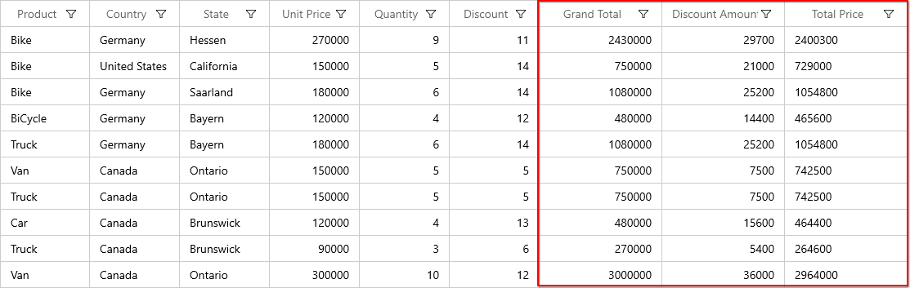
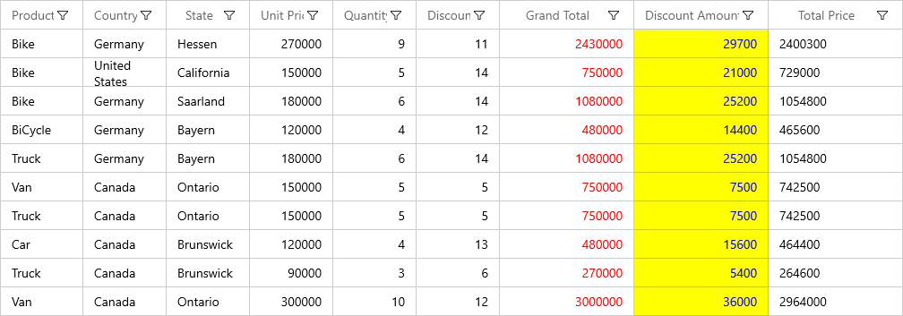

# How to create WinUI DataGrid (SfDataGrid) with calculated columns (Unbound Columns)?

## About the sample
This example illustrates how to create WinUI DataGrid (SfDataGrid) with calculated columns (Unbound Columns)?

[WinUI DataGrid](https://www.syncfusion.com/winui-controls/datagrid) (SfDataGrid) allows adding **additional columns** which are **not bound with data object** from the underlying data source. [GridUnboundColumn](https://help.syncfusion.com/cr/winui/Syncfusion.UI.Xaml.DataGrid.GridUnboundColumn.html) class used to add an unbound column. Unbound columns supports for sorting, filtering, grouping, exporting and printing as normal columns. 

```XML

<syncfusion:GridUnboundColumn Width="150"
                              AllowEditing="False"
                              Expression="Quantity*Amount"
                              HeaderText="Grand Total"
                              MappingName="GrandTotal"
                              TextAlignment="Right" />

```



#### Note: It is mandatory to specify the GridColumn.MappingName for GridUnBoundColumn with some name to identify the column. It is not necessary to define name of field in the data object.

## Populating data for unbound column Using Expression

[Expression](https://help.syncfusion.com/cr/winui/Syncfusion.UI.Xaml.DataGrid.GridUnboundColumn.html#Syncfusion_UI_Xaml_DataGrid_GridUnboundColumn_Expression) property used to compute and display expressions like arithmetic or logic. By default, [GridUnboundColumn](https://help.syncfusion.com/cr/winui/Syncfusion.UI.Xaml.DataGrid.GridUnboundColumn.html) evaluates the expression with casing. Disable the casing while evaluating the expression by setting [CaseSensitive](https://help.syncfusion.com/cr/winui/Syncfusion.UI.Xaml.DataGrid.GridUnboundColumn.html#Syncfusion_UI_Xaml_DataGrid_GridUnboundColumn_CaseSensitive) property to **false**.

```XML

<syncfusion:SfDataGrid x:Name="dataGrid"
                               AutoGenerateColumns="False"
                               AllowFiltering="True"
                               ColumnWidthMode="Star"
                               AllowEditing="True"
                               ItemsSource="{Binding ProductInfo}">
            <syncfusion:SfDataGrid.Columns>
                <!--  UnBoundColumn with Expressions  -->
                <syncfusion:GridUnboundColumn Width="150"
                                              AllowEditing="False"
                                              Expression="Quantity*Amount"
                                              HeaderText="Grand Total"
                                              MappingName="GrandTotal"
                                              TextAlignment="Right" />

                <syncfusion:GridUnboundColumn Width="150"
                                              AllowEditing="False"
                                              Expression="Amount*Discount/100"
                                              HeaderText="Discount Amount"
                                              MappingName="DiscountAmount"
                                              TextAlignment="Right" />

                <syncfusion:GridUnboundColumn Width="150"
                                              Expression="((Quantity*Amount) - (Amount*Discount/100))"
                                              HeaderText="Total Price"
                                              MappingName="TotalPrice" />
            </syncfusion:SfDataGrid.Columns>
</syncfusion:SfDataGrid>

```



Below are the list of Arithmetic and logical operations supported.

|   Arithmetic operations  |  Operator |
| -------------------------|:---------:| 
|    Add                   |     +     | 
|    Subtract              |     -     |  
|    Multiply              |     *     |  
|    Divide                |     /     | 
|    Power                 |     ^     |  
|    Mod                   |     %     |  
|    Greater Than          |     >     |  
|    Less Than             |     <     |  
|    Equal                 |     =     | 
|    GreaterThanOrEqual    |     >=    |  
|    LessThanOrEqual       |     <=    |  


|   Logical operations	|   Operators |
| ----------------------|:-----------:| 
|       AND	            |  (char)135  |
|       OR	            |  (char)136  |
|       NOT	            |  (char)137  |


## Read unbound column values

[GetUnboundCellValue](https://help.syncfusion.com/cr/winui/Syncfusion.UI.Xaml.DataGrid.SfDataGrid.html#Syncfusion_UI_Xaml_DataGrid_SfDataGrid_GetUnboundCellValue_Syncfusion_UI_Xaml_DataGrid_GridColumn_System_Object_) method is used to get the value of [GridUnboundColumn](https://help.syncfusion.com/cr/winui/Syncfusion.UI.Xaml.DataGrid.GridUnboundColumn.html).

```C#

this.dataGrid.CurrentCellValueChanged += OnCurrentCellValueChanged;

private void OnCurrentCellValueChanged(object sender, CurrentCellValueChangedEventArgs e)
{
     var updateValue = this.dataGrid.GetUnboundCellValue(dataGrid.Columns[4], this.dataGrid.CurrentItem);
}


```

## Styling unbound column

The style of unbound column customizes by writing style of TargetType [GridCell](https://help.syncfusion.com/cr/winui/Syncfusion.UI.Xaml.DataGrid.GridCell.html) or setting [GridColumn.CellStyle](https://help.syncfusion.com/cr/winui/Syncfusion.UI.Xaml.Grids.GridColumnBase.html#Syncfusion_UI_Xaml_Grids_GridColumnBase_CellStyle) property.

```XML

<Grid.Resources>
            <Style x:Key="ApplyCellStyle" TargetType="syncfusion:GridCell">
                <Setter Property="Foreground" Value="Blue" />
                <Setter Property="Background" Value="Yellow"/>
            </Style>
</Grid.Resources>

<syncfusion:SfDataGrid x:Name="dataGrid"
                               AutoGenerateColumns="False"
                               AllowFiltering="True"
                               ColumnWidthMode="Star"
                               AllowEditing="True"
                               ItemsSource="{Binding ProductInfo}">
            <syncfusion:SfDataGrid.Columns>
                <!--  UnBoundColumn with Expressions  -->
                <syncfusion:GridUnboundColumn Width="150"
                                              AllowEditing="False"
                                              Expression="Quantity*Amount"
                                              HeaderText="Grand Total"
                                              MappingName="GrandTotal"
                                              TextAlignment="Right" >
                    <syncfusion:GridUnboundColumn.CellStyle>
                        <Style TargetType="syncfusion:GridCell">
                            <Setter  Property="Foreground"  Value="Red" />
                        </Style>
                    </syncfusion:GridUnboundColumn.CellStyle>
                </syncfusion:GridUnboundColumn>

                <syncfusion:GridUnboundColumn Width="150"
                                              AllowEditing="False"
                                              Expression="Amount*Discount/100"
                                              HeaderText="Discount Amount"
                                              CellStyle="{StaticResource ApplyCellStyle}"
                                              MappingName="DiscountAmount"
                                              TextAlignment="Right" />

                <syncfusion:GridUnboundColumn Width="150"
                                              Expression="((Quantity*Amount) - (Amount*Discount/100))"
                                              HeaderText="Total Price"
                                              MappingName="TotalPrice" />
            </syncfusion:SfDataGrid.Columns>
</syncfusion:SfDataGrid>

```

The following screenshot shows the cell style applied [GridUnboundColumn](https://help.syncfusion.com/cr/winui/Syncfusion.UI.Xaml.DataGrid.GridUnboundColumn.html),



Take a moment to peruse the [WinUI DataGrid - Unbound Column](https://help.syncfusion.com/winui/datagrid/unbound-column) documentation, where you can find about GridUnboundColumn with code examples.

## Requirements to run the demo
Visual Studio 2019 and above versions
